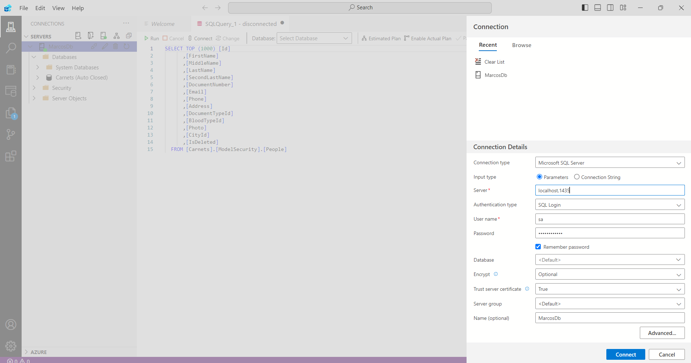
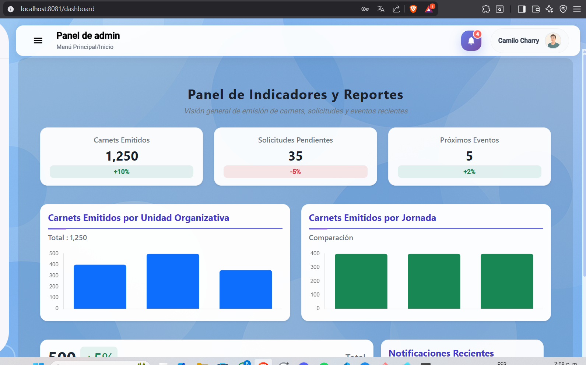
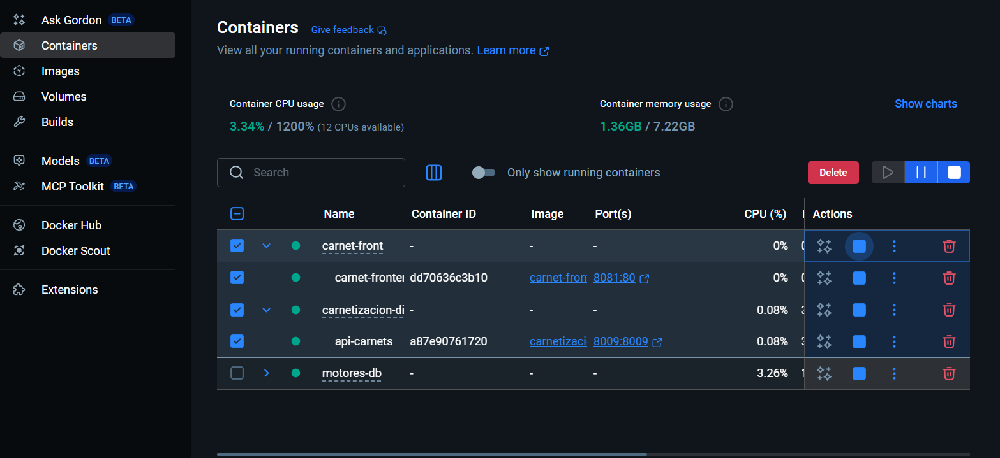

Despliegue del proyecto en Docker:

 Evidencia del Base de datos :

 

 

 Contenedor del Back en Docker:

 

 Prueba del Back corriendo:

 

 Prueba del front corriendo(se comprueba porque antes de mostrar la verificacion se valida un usuario en el back)  

 

Docker con los contenedores :

